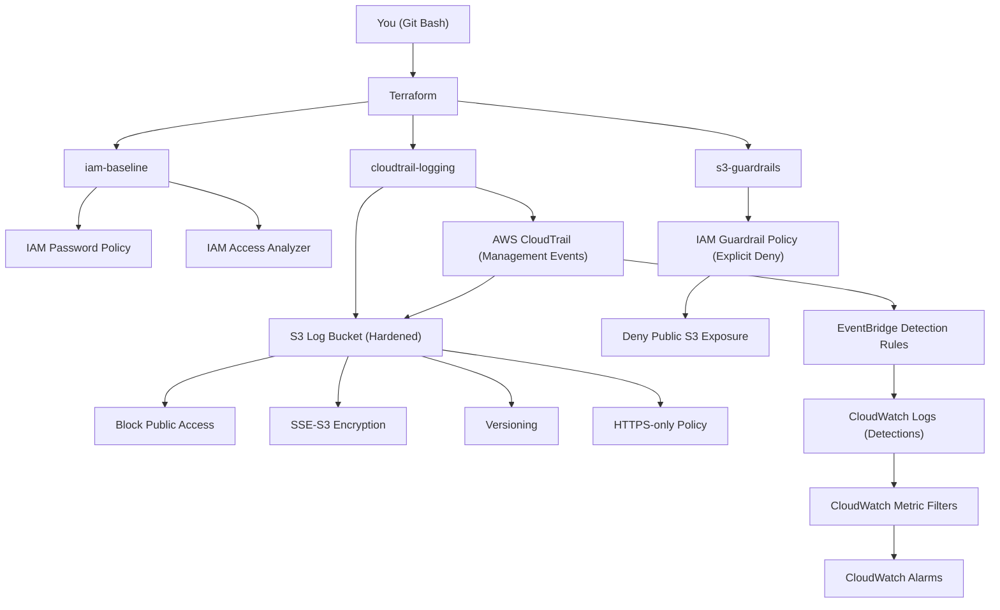

# AWS Cloud Hardening Baseline (Terraform)

A **cost-conscious AWS security baseline** focused on **cloud defense**, **misconfiguration prevention**, and **audit readiness**.

This project demonstrates **Cloud Security / Blue Team** skills using **Infrastructure as Code (Terraform)**, with an emphasis on **secure-by-default configurations** and **zero-cost awareness**.

---

## 🎯 Objectives

- Establish a secure AWS foundation
- Prevent common cloud security misconfigurations
- Enable audit and forensic readiness
- Remain compatible with AWS Free Tier (near $0)
- Detect high-risk actions through audit logs
- Trigger alerts on critical security events

---

## 🧱 Architecture Overview

This project is structured in two layers:

### 1 — Hardening (Preventive controls)
- **IAM hardening**
  - Strong account password policy
  - IAM Access Analyzer
- **Centralized logging**
  - CloudTrail enabled (management events)
  - Logs stored in a hardened S3 bucket
- **Preventive guardrails**
  - IAM deny policies preventing public S3 exposure

### 2.1 — Detection (Defensive visibility)
- **Event-driven detections**
  - EventBridge rules matching high-risk CloudTrail events
- **Centralized detection logs**
  - CloudWatch Log Group with short retention (cost control)

All resources are managed via **Terraform modules**, following a design-first and cost-conscious approach.
### V2.2 — Alerting (Signal escalation)
- Metric-based alerting
  - CloudWatch metric filters applied to detection logs
- Security alarms
  - CloudWatch alarms triggered on high-risk actions
- Design-first approach
  - Alert logic defined without assuming a notification channel (SNS optional)

---
## 🗺️ Architecture Diagram



## 📦 Terraform Modules

### `iam-baseline`

- Enforces a strong IAM password policy
- Enables IAM Access Analyzer to detect unintended external access

### `cloudtrail-logging`

- Enables AWS CloudTrail
- Stores logs in a dedicated S3 bucket
- Encryption at rest (SSE-S3)
- HTTPS-only access enforced
- Versioning enabled

### `s3-guardrails`

- IAM deny policies preventing:
  - Making S3 buckets public
  - Disabling S3 Public Access Block
- Protects against common real-world misconfigurations
### `alerting-cloudwatch` (V2)

- CloudWatch Log Group dedicated to detection events
- Short log retention (7 days) to control costs
- Central sink for security-relevant activity

### `detection-eventbridge` (V2)

- EventBridge rules matching high-risk CloudTrail events:
  - CloudTrail tampering
  - IAM privilege escalation attempts
  - Credential creation
  - S3 exposure-related changes
- Events forwarded to CloudWatch Logs for analysis
---
### `alerting-alarms` (V2.2)

- CloudWatch metric filters applied to detection logs
- CloudWatch alarms for:
  - CloudTrail tampering
  - IAM policy changes
  - Credential creation
  - S3 exposure attempts
- Alerts designed to be SNS-ready but provider-agnostic

## 💰 Cost Control

This project is designed to be **free-tier friendly**.

Deliberately avoided services:

- GuardDuty
- Security Hub
- VPC Flow Logs
- NAT Gateways
- EC2 / RDS
- OpenSearch

Cost guardrails are documented in `COST_GUARDRAILS.md`.

---

## 🚀 Usage

### Prerequisites

- Terraform >= 1.5
- (Optional) AWS CLI + credentials

### Validate configuration (no AWS access required)

```bash
cd terraform
terraform init
terraform validate
```
### Plan & Apply (optional, requires AWS credentials)
```bash
terraform plan
terraform apply
```

### Destroy all resources
```bash
terraform destroy
```
---
### 📚 Documentation
- CIS mapping: docs/cis-mapping.md

- Hardening decisions: docs/hardening-decisions.md
---
### 🔒 Security Notes
- No secrets are committed to Git

- Terraform state files are ignored via .gitignore

- Preventive security controls use explicit deny policies

- Designed for defensive (Blue Team) cloud security use cases
---
## 🛣️ Roadmap

- SNS notification integration (optional)
- Automated response (Lambda remediation)
- Organization-level guardrails (SCPs)
- Incident response automation

---
This project focuses on **security design and defensive architecture**, rather than production deployment, and is intended as a learning and demonstration baseline for cloud defense.
### 👤 Author
Sacha Gatta-Boucard
- Cloud Security / Blue Team oriented project

---

## ❓ FAQ

**Is this deployed on AWS?**  
No. This project is design-first and statically validated. Runtime behavior requires an AWS account.

**Is alerting implemented?**  
Alert logic is fully defined. Notification channels (SNS, email, Slack) are intentionally optional.

**Is this production-ready?**  
This project is a learning and demonstration baseline, not a full production security platform.

**Why focus on EventBridge for detection?**  
EventBridge provides low-cost, event-driven detection well-suited for high-signal CloudTrail events.


