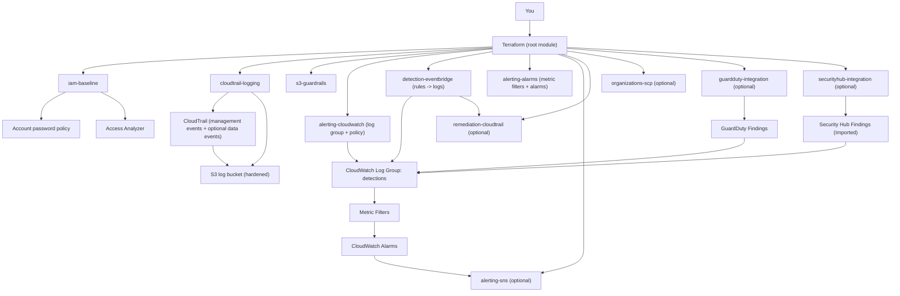

# AWS Cloud Hardening Baseline (Terraform)
> Security baseline • Terraform • Blue Team • Lab-tested

A **cost-conscious AWS security baseline** focused on **hardening, detection, alerting, and optional remediation**, implemented entirely with **Terraform modules**.

This project is designed as a **Blue Team / Cloud Security portfolio baseline**: secure defaults, explicit guardrails, high-signal detections based on CloudTrail events — without relying on expensive managed security services.

---

## Project goals

- Reduce the AWS attack surface with preventive controls
- Ensure audit and forensic readiness
- Detect high-risk security events
- Provide actionable alerts
- Optionally auto-remediate critical logging tampering
- Remain free-tier friendly and easy to reason about

---
## Overview

This Terraform baseline hardens AWS logging & detection by:
- Enforcing a hardened CloudTrail configuration (multi-region, global services, log validation, optional KMS).
- Optionally enabling CloudTrail **data events** (S3 object-level and/or Lambda invoke) for targeted resources.
- Providing an EventBridge-triggered **auto-remediation Lambda** that restores CloudTrail settings if modified.
- Routing high-severity findings from **GuardDuty** and **Security Hub** into a detections CloudWatch Log Group,
  with metric filters + CloudWatch alarms (optional SNS notifications).

## What this baseline provides

### Hardening (preventive controls)

- **IAM baseline**
  - Strong account password policy
  - IAM Access Analyzer enabled at account level

- **Centralized audit logging**
  - CloudTrail enabled for management events
  - Multi-region trail (configurable)
  - Log file integrity validation enabled
  - Optional organization trail support
  - Dedicated hardened S3 bucket for logs:
    - Block Public Access enabled
    - Versioning enabled
    - TLS-only bucket policy
    - Encryption at rest (SSE-S3 by default, optional SSE-KMS)
    - Optional lifecycle expiration
    - Stricter CloudTrail bucket policy conditions:
      - Confused deputy protection using `aws:SourceAccount`
      - Trail-bound writes using `aws:SourceArn`
      - Optional multi-account delivery support for org trails (`AWSLogs/*`)

- **S3 guardrails**
  - Explicit deny policies preventing:
    - Making buckets public (ACLs, policies, public access block)
    - Disabling account-level S3 Public Access Block
  - Policies can be attached to a user or role

- **Optional organization-level guardrails**
  - Service Control Policy (SCP) module
  - Prevents:
    - CloudTrail tampering (StopLogging, DeleteTrail, UpdateTrail, PutEventSelectors, PutInsightSelectors)
    - Disabling S3 Public Access Block
    - Leaving the organization
  - Optional exemption list for break-glass / Terraform roles

---

### Detection (visibility)

- **EventBridge detection rules** based on CloudTrail logs:
  - CloudTrail tampering attempts
  - IAM policy changes
  - Credential creation events
  - S3 exposure attempts

- **Centralized detection log**
  - CloudWatch Logs log group dedicated to security detections
  - Retention configurable (default: 30 days)

---

### Alerting (signal escalation)

- CloudWatch metric filters on detection logs
- CloudWatch alarms for each detection category
- Optional SNS topic for alert delivery
- Optional email subscription for notifications
- Allow using an existing SNS topic instead of always creating one”
- Example tfvars avec `create_sns_topic=false` + `alarm_sns_topic_arn=...`
---

### Optional automated remediation

- Lambda-based auto-remediation module
- Triggered by EventBridge when CloudTrail tampering is detected
- Can:
  - Re-enable logging after `StopLogging`
  - Re-apply baseline settings after `UpdateTrail`
  - Restore expected event selectors
- Disabled by default
- Fully optional and modular

---

## Architecture


All detection signals converge into a single `detections` CloudWatch Log Group, then become metrics and alarms (optional SNS).

---

## Terraform modules

- **iam-baseline**
  - Account password policy
  - IAM Access Analyzer

- **cloudtrail-logging**
  - CloudTrail (management events)
  - Multi-region support
  - Optional organization trail
  - Hardened S3 log bucket
  - Strict bucket policy conditions
  - Optional lifecycle expiration
  - Optional KMS encryption

- **s3-guardrails**
  - Explicit deny IAM policy preventing S3 public exposure
  - Attachment to IAM user or role

- **alerting-cloudwatch**
  - CloudWatch Logs log group for detections
  - Resource policy allowing EventBridge to write logs

- **detection-eventbridge**
  - EventBridge rules for security-relevant CloudTrail events
  - Log group as target
  - Optional Lambda invocation for auto-remediation

- **alerting-alarms**
  - CloudWatch metric filters
  - CloudWatch alarms for:
    - CloudTrail tampering
    - IAM policy changes
    - Credential creation
    - S3 exposure attempts

- **alerting-sns**
  - SNS topic
  - Optional email subscription

- **remediation-cloudtrail (optional)**
  - Lambda function
  - IAM role and permissions
  - Automatically restores CloudTrail baseline configuration

- **organizations-scp (optional)**
  - Service Control Policy
  - Organization-level enforcement
  - Optional exemption list
  - 
- **guardduty-integration (optional)**
  - (Optional) GuardDuty detector enablement
  - EventBridge rule to forward high-severity findings to detections log group
  - Metric filter + alarm (optional SNS)

- **securityhub-integration (optional)**
  - (Optional) Security Hub enablement
  - EventBridge rule to forward imported findings to detections log group
  - Metric filter + alarm (optional SNS)

---

## Cost considerations

This baseline is designed to remain **near $0** for a lab or portfolio environment:

- CloudTrail uses management events only
- CloudWatch Logs retention is limited
- S3 lifecycle expiration is optional
- Lambda is invoked only on security events

The following managed services are **optional** and disabled by default (can increase costs):

- GuardDuty (optional integration)
- Security Hub (optional integration)

The baseline core does not require them and remains cost-conscious when they are disabled.

**Note:** CloudTrail data events (S3 object-level / Lambda invoke) are also optional and may increase costs depending on volume.


The following services are deliberately not used:


- VPC Flow Logs
- OpenSearch / SIEM stacks
- NAT Gateways
- EC2 or persistent compute

**Important:** enabling KMS encryption may introduce additional costs.  
Organization-level features require AWS Organizations permissions.

## Optional managed services

This baseline is designed to work without managed security services by default.
However, it can optionally integrate:
- GuardDuty (high severity findings → detections log group → alarms)
- Security Hub (imported findings → detections log group → alarms)

These are disabled by default for cost-conscious deployments.

---

## Usage

### Prerequisites

- Terraform `= 1.6`
- AWS credentials (only required for `plan/apply`)
- A globally-unique S3 bucket name for CloudTrail logs

---

## Quick start (static validation)

```bash
cd terraform
terraform init
terraform fmt -check
terraform validate
```

## Deploy in AWS (lab)

Create a `terraform.tfvars`:

```hcl
prefix = "baseline"

cloudtrail_log_bucket_name = "my-unique-cloudtrail-logs-123456"
guardrails_target_name     = "my-iam-user-or-role"

# Logging / Retention
cw_log_retention_days      = 30
cloudtrail_retention_days  = 0 # 0 disables expiration

# Notifications (optional)
sns_email                  = null # set to "you@domain.com" to receive alerts
create_sns_topic           = true
alarm_sns_topic_arn        = null # set if create_sns_topic=false

# CloudTrail remediation (optional)
enable_cloudtrail_auto_remediation = false
cloudtrail_is_organization_trail   = false
enable_org_scp                     = false

# CloudTrail data events (optional; can add cost)
cloudtrail_enable_s3_data_events     = false
cloudtrail_s3_data_event_bucket_arns = []
cloudtrail_enable_lambda_data_events = false
cloudtrail_lambda_data_event_function_arns = []
cloudtrail_data_events_read_write_type = "All" # All | ReadOnly | WriteOnly

# Managed detections integrations (optional; can add cost)
enable_guardduty_integration   = false
guardduty_severity_min         = 7

enable_securityhub_integration = false
securityhub_severity_labels    = ["HIGH", "CRITICAL"]
securityhub_record_states      = ["ACTIVE"]
securityhub_workflow_states    = []

```

Then:

```bash
terraform plan
terraform apply
```

## Destroy

```bash
terraform destroy
```

---

## Deployment notes

- Terraform state is ignored by default; for real usage, a remote encrypted backend is recommended.
- Guardrail policies use explicit deny and can block destructive actions.
  - In practice, Terraform should be executed using a dedicated role not restricted by the guardrails,
    or guardrails should be attached after the baseline is deployed.
- SCP deployment must be executed from the AWS Organizations management account.
- `enable_guardrails_attachment = false` -> “creates policy only”
---

## Detection testing (example scenarios)

You can generate detections with AWS CLI actions such as:

- `iam:CreateAccessKey`
- `iam:AttachUserPolicy`
- `cloudtrail:StopLogging`
- `cloudtrail:UpdateTrail`
- `s3:PutBucketPolicy`

Detections are written to:
- CloudWatch Logs: `/aws/cloud-hardening-baseline/detections` (default)

Alarms:

- `ALERT-CloudTrail-Tampering`
- `ALERT-IAM-Policy-Changes`
- `ALERT-Credential-Creation`
- `ALERT-S3-Exposure-Attempt`
  When optional integrations are enabled:
- `ALERT-GuardDuty-High-Severity`
- `ALERT-SecurityHub-High-Severity`

---

## Documentation

- CIS mapping: `docs/cis-mapping.md`
- Hardening decisions: `docs/hardening-decisions.md`
- Detection logic: `docs/detection.md`
- References: `docs/references.md`
- Versioning policy: `docs/versioning.md`
- Changelog: `docs/changelog.md`

---

## Known limitations

- Event propagation from CloudTrail to EventBridge is not instantaneous
- This baseline does not aim to provide full security coverage
- SNS notifications are optional
- KMS usage may affect the cost model
- Auto-remediation is intentionally conservative and does not recreate deleted trails

---

## Roadmap ideas

- Allow using an existing SNS topic instead of always creating one
- Extend auto-remediation logic (e.g., additional CloudTrail hardening checks)
- Multi-account / Organizations: delegated admin + central findings/log aggregation

---

## Author

Sacha Gatta-Boucard  
Cloud Security / Blue Team oriented portfolio project
