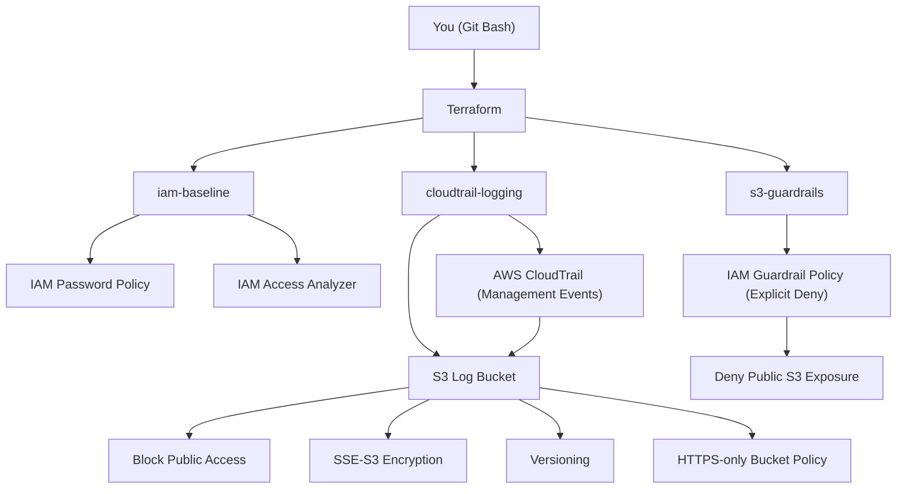

# AWS Cloud Hardening Baseline (Terraform)

A **cost-conscious AWS security baseline** focused on **cloud defense**, **misconfiguration prevention**, and **audit readiness**.

This project demonstrates **Cloud Security / Blue Team** skills using **Infrastructure as Code (Terraform)**, with an emphasis on **secure-by-default configurations** and **zero-cost awareness**.

---

## 🎯 Objectives

- Establish a secure AWS foundation
- Prevent common cloud security misconfigurations
- Enable audit and forensic readiness
- Remain compatible with AWS Free Tier (near $0)

---

## 🧱 Architecture Overview

This baseline deploys security controls only (no application workload):

- **IAM hardening**
  - Strong account password policy
  - IAM Access Analyzer
- **Centralized logging**
  - CloudTrail enabled (management events)
  - Logs stored in a hardened S3 bucket
- **Preventive guardrails**
  - IAM deny policies preventing public S3 exposure

All resources are managed via **Terraform modules**.

---
## 🗺️ Architecture Diagram



## 📦 Terraform Modules

### `iam-baseline`

- Enforces a strong IAM password policy
- Enables IAM Access Analyzer to detect unintended external access

### `cloudtrail-logging`

- Enables AWS CloudTrail
- Stores logs in a dedicated S3 bucket
- Encryption at rest (SSE-S3)
- HTTPS-only access enforced
- Versioning enabled

### `s3-guardrails`

- IAM deny policies preventing:
  - Making S3 buckets public
  - Disabling S3 Public Access Block
- Protects against common real-world misconfigurations

---

## 💰 Cost Control

This project is designed to be **free-tier friendly**.

Deliberately avoided services:

- GuardDuty
- Security Hub
- VPC Flow Logs
- NAT Gateways
- EC2 / RDS
- OpenSearch

Cost guardrails are documented in `COST_GUARDRAILS.md`.

---

## 🚀 Usage

### Prerequisites

- Terraform >= 1.5
- (Optional) AWS CLI + credentials

### Validate configuration (no AWS access required)

```bash
cd terraform
terraform init
terraform validate
```
### Plan & Apply (optional, requires AWS credentials)
```bash
terraform plan
terraform apply
```

### Destroy all resources
```bash
terraform destroy
```
---
### 📚 Documentation
- CIS mapping: docs/cis-mapping.md

- Hardening decisions: docs/hardening-decisions.md
---
### 🔒 Security Notes
- No secrets are committed to Git

- Terraform state files are ignored via .gitignore

- Preventive security controls use explicit deny policies

- Designed for defensive (Blue Team) cloud security use cases
---
### 🛣️ Roadmap
- Detection layer (GuardDuty / Security Hub)

- Automated alerting

- Organization-level guardrails (SCPs)

- Incident response automation
---
### 👤 Author
Sacha Gatta-Boucard
- Cloud Security / Blue Team oriented project


